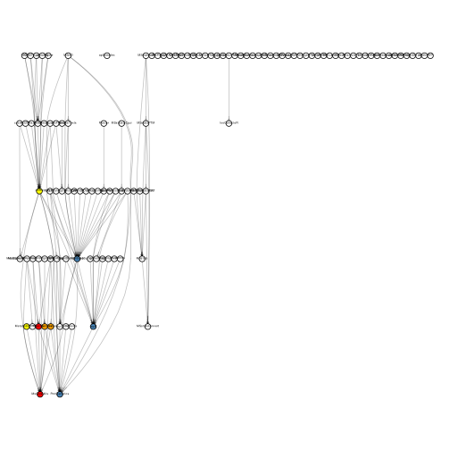
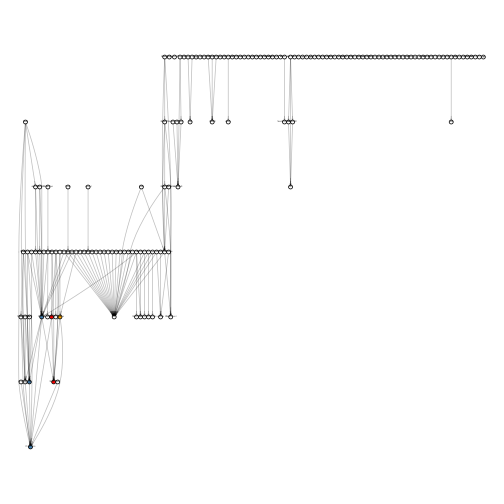

# Bioconductor Mass Spectrometry Working Group


the Bioconductor community that are interested and/or active in the
area of mass spectrometry, proteomics and/or metabolomics and define
technical needs or community expectations to prioritise future
developments. More specifically, we suggest the following steps.

- Reference relevant MS/proteomics/metabolomics packages in
  Bioconductor and their dependencies. Are there sets of packages that
  interoperate? Are there many packages that perform very similar or
  identical tasks? Is there scope for better interoperability?
- List active MS/proteomics/metabolomics maintainers/users and invite
  them to join the working group.
- Identify missing features and/or areas that the working group could
  focus on.
- Promote the usage of the #mass-spectrometry, #proteomics and
  #metabolomics channels on slack with the aim to organise regular
  (open) meetings and/or dedicated workshops.


```{r contribs, include = FALSE}
source("R/contribs.R")
```

```{r deps, include = FALSE}
source("R/biocdeps.R")
```

## Packages

Bioconductor packages are annotated with *biocView* tags. As of
release 3.14, there are:

```{r ms, echo = FALSE, results = "asis"}
ms_packages <- describeBiocView(bv[["MassSpectrometry"]])
```

Dependency graph (depends and imports):

```{r echo = FALSE}

```

Explore [MassSpectrometry](https://bioconductor.org/packages/release/BiocViews.html#___MassSpectrometry) packages


```{r prot, echo = FALSE, results = "asis"}
prot_packages <- describeBiocView(bv[["Proteomics"]])
```
Dependency graph (depends and imports):

```{r echo = FALSE}

```

Explore [Proteomics](https://bioconductor.org/packages/release/BiocViews.html#___Proteomics) packages

```{r metab, echo = FALSE, results = "asis"}
metabo_packages <- describeBiocView(bv[["Metabolomics"]])
```
Dependency graph (depends and imports):

```{r echo = FALSE}
knitr::include_graphics("./figs/metabo_deps.svg")
```

Explore [Metabolomics](https://bioconductor.org/packages/release/BiocViews.html#___Metabolomics) packages
